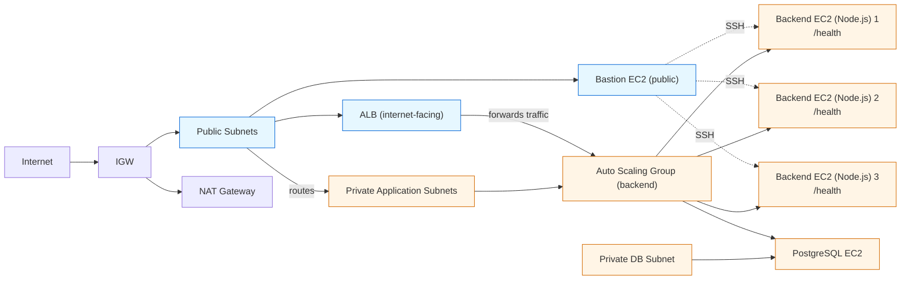

# Architecture Overview

## Infrastructure diagram


## SSH topology

```text
Local PC
  |
  +--> Bastion EC2 (public)
           |
           +--> Backend EC2 (private)
           |
           +--> PostgreSQL EC2 (private)
```

## CI/CD flow

```text
GitHub main
  |
  v
GitHub Actions
  |
  +--> test
  +--> build
  +--> package
  +--> deploy
  |
  v
ALB / ASG / Backend instances
```

## Security model

- Public: ALB, Bastion, NAT.
- Private: backend ASG, PostgreSQL EC2.
- Database and backend are never directly exposed to the internet.
- Access to SSH is restricted to `admin_cidr` only.
